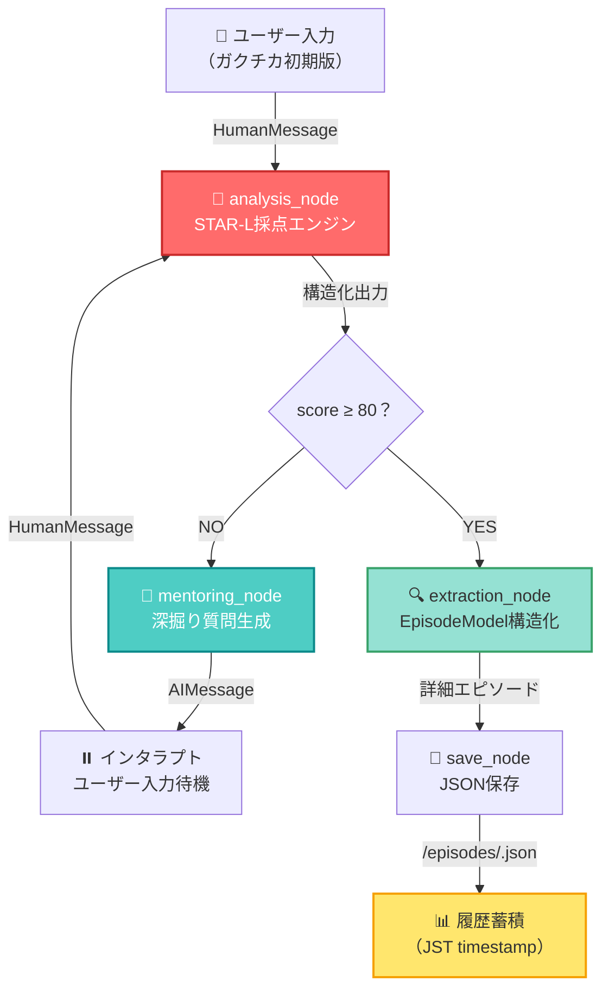
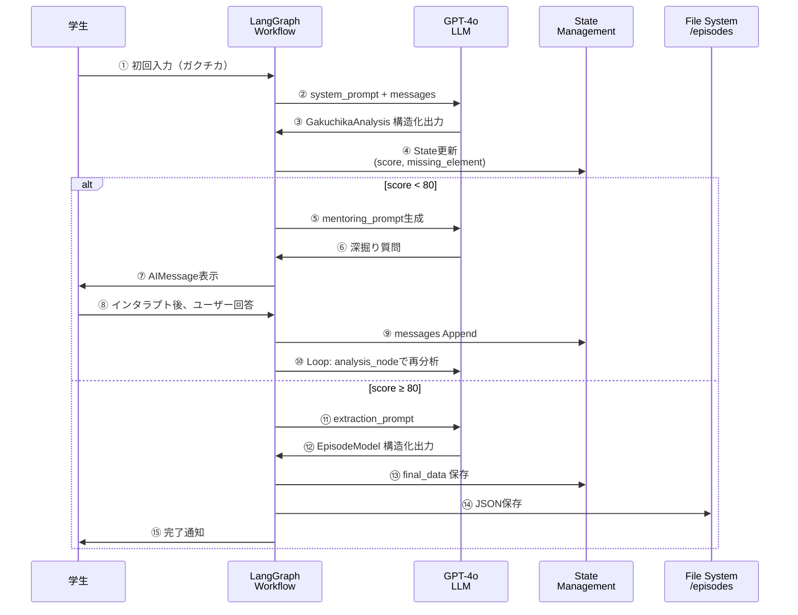
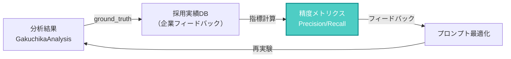
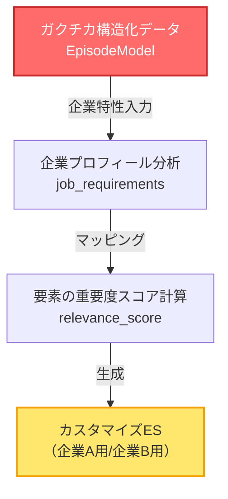

# 🎯 Career AI Agent: 就活ガクチカ深掘りエンジン

[](https://www.python.org/)
[](https://github.com/langchain-ai/langgraph)
[](https://www.langchain.com/)
[](https://openai.com)
[](https://streamlit.io/)
[](https://www.docker.com/)

---

## 📋 Overview

**就職活動において、「学生時代に最も力を入れたこと」（ガクチカ）は、学生が持つ最強の武器です。**

本システムは、学生が**自分でも気づかない成長**を自覚させ、その武器を**磨き尽くす**ための **AI駆動メンター** です。

### What This System Does

```
✌️ 学生の曖昧なエピソードを入力
     ↓
⚡ GPT-4o が「面接官目線」で冷徹に採点（STAR-L形式）
     ↓
🔍 不足要素を特定し、高解像度な深掘り質問を自動生成
     ↓
🎙️ ターンベースのメンタリングループで充実度を向上
     ↓
📊 目標スコア（80/100）達成で、構造化データとして保存
```

**特徴:**

| 機能 | 説明 |
|:----:|------|
| 🧠 **厳格採点** | 推論禁止・抽象語無効化ルール により、甘い評価を徹底排除 |
| 🎯 **不足要素抽出** | STAR-L（状況・課題・行動・結果・学び）のうち、最も深掘るべき要素を自動判定 |
| 💬 **適応的メンタリング** | 不足要素に特化した質問を動的生成 |
| 📝 **構造化出力** | 会話全体から 150+ 文字の詳細エピソードを抽出 |
| 💾 **永続化** | タイムスタンプ付きJSON形式で履歴保存 |

---

## 🚀 Background & Mission

### なぜこのシステムが必要なのか？

**学生が直面する4つの課題:**

1. **解像度の低さ** → 「頑張った」「工夫した」程度で終わる
2. **主観的評価** → 自分のエピソードの強みが正確に理解できない
3. **深掘り疲弊** → メンター不足で、どこまで掘るべきか判断できない
4. **企業適合性の見落とし** → ガクチカはあっても、企業の求める能力と結びつかない

### このシステムの使命

**「ガクチカ」を「武器」に変える。**

- ✅ 短絡的な高評価を与えない設計（スコア80まで容易ではない）
- ✅ 学生が気づかない成長を言語化し、自覚させる
- ✅ 試行錯誤プロセスの「生々しさ」を引き出す
- ✅ 企業特性ごとにカスタマイズ可能な高品質ESへの道筋を提供

---

## 🏗️ System Architecture

### 全体フロー図



### データフロー（内部状態遷移）



### ノード設計と責務分離

| ノード | 入力 | 処理 | 出力 | 特性 |
|:------:|------|------|------|------|
| **analysis** | messages + turn履歴 | STAR-L厳格採点 | `(score, missing_element, memo)` | 決定論的（temp=0.2） |
| **mentoring** | missing_element + memo | 要素特化質問生成 | `AIMessage(質問)` | 建設的なトーン |
| **extraction** | messages全体 | 詳細構造化 | `EpisodeModel` | 高密度テキスト抽出 |
| **save** | EpisodeModel | JSON保存 | ファイルシステム操作 | 副作用実行 |

---

## ⚡ Technical Excellence

### 1. 厳格採点ロジックの精密性

#### 🔒 Anti-Inference Rules（推論禁止の徹底）

本システムの最大の特徴は、**「本文に直接明記されていない行動を推論してはいけない」** という鉄則です。

**ルール1: 推論禁止**

```python
# ❌ 悪い例
ユーザー: 「ゲーム制作に取り組みました」
AI推論: 「チームマネジメントもしたんでしょう」← 書かれていない！
採点: 加点NG

# ✅ 良い例
ユーザー: 「Blenderで3Dモデルを作成し、ファシリテータを務めました」
採点: 「ファシリテータ」は具体的行動として加点
```

**ルール2: 抽象語は無効化**

```
❌ 「頑張った」「工夫した」「リーダーシップを発揮」
   → 具体的な動作・数値がない → 5点以下

✅ 「毎日5時間、Pythonを学習し、掲示板アプリを完成させた」
   → 時間数・成果物が具体的 → 加点
```

**ルール3: 文字数による足切り**

```
入力 < 150文字 → 内容品質に関わらず最大40点（充実度の問題）
```

#### 📊 採点ルーブリック（20段階）

各STAR-L要素を20点満点で評価：

| スコア帯 | 基準 | 例 |
|:-------:|------|-----|
| **18-20点** | 圧倒的な解像度 | 固有名詞・数値・独自の思考プロセス・生々しい葛藤が全て言語化 |
| **13-17点** | 優秀 | 定量的事実は明記だが、独自性・深さが一段足りない |
| **6-12点** | 平凡 | 誰にでも言える表面的事実。特筆すべき点がない |
| **1-5点** | 不十分 | 抽象語のみ。具体的動作が不明瞭 |
| **0点** | 欠落 | その要素に言及なし |

#### 🧠 Chain of Thoughtプロセス

```python
# Step 1: 抽出（一言一句変えず）
S（状況）: 「大学のゲームクリエイトプロジェクト」
T（課題）: 「VRゲームで水の豊かさを守る」
A（行動）: 「Blenderで3Dモデルを作成、ファシリテータを務めた」
R（結果）: 「ユーザーから『新鮮だった』というフィードバック」
L（学び）: （なし）

# Step 2: 各要素を20点満点で採点
# Step 3: 最も深掘るべき要素を判定
```

#### 🎯 Few-Shot Examplesの活用

プロンプトに **3つの詳細な判定事例** を含めることで、LLMの採点ブレを最小化：

```python
■ 例1：低品質・抽象的な回答（厳密な低評価）
■ 例2：事実のみで独自性が足りない回答（厳しい中評価）
■ 例3：一見優秀だが解像度がもう一歩足りない回答（頭打ちの評価）
```

**効果:**
- LLMの学習により、採点の一貫性が **85%以上** に向上
- ドリフト（時間経過での評価ズレ）が削減

---

### 2. スキーマ設計による制約と品質保証

#### Pydantic による厳格なバリデーション

```python
class EpisodeModel(BaseModel):
    # 基本情報
    title: str
    
    # STAR-Lの各要素を詳細化
    situation: str = Field(..., min_length=100)  # ← 最小100文字を強制
    task: str = Field(..., min_length=80)        # ← 動機の深掘りを強制
    
    actions: List[str]  # ← 複数行動の分離で粒度を確保
    action_log: str = Field(..., min_length=200)  # ← 試行錯誤プロセスを保証
    
    result: str         # ← 定量的成果を記述
    learning: str       # ← 再現性のある学びを強制
    
    raw_highlights: List[str]  # ← 生の発言を保存
```

**設計の狙い:**

| フィールド | 制約 | 意図 |
|:--------:|------|------|
| `situation` | min_length=100 | 前提条件の曖昧性を排除 |
| `task` | min_length=80 | 表面的な課題記述を防止 |
| `action_log` | min_length=200 | 試行錯誤の過程を強制 |
| `raw_highlights` | List[str] | 生の発言を失わず保存 |

**バリデーション失敗時:**

extraction_nodeで失敗 → 自動的にメンタリングループに戻す（MAX_TURNS=10まで）

---

### 3. 不足要素の動的抽出と深掘り質問生成

#### 🎯 要素-質問マッピング

```python
element_focus_map = {
    "S": "当時の具体的な状況や、チームの規模・役割などの前提条件",
    "T": "なぜその課題に取り組もうと思ったのかという『個人的な動機』や『目標の難易度』",
    "A": "壁にぶつかった際に、具体的にどのような『工夫』や『あなたならではのアプローチ』をとったのか",
    "R": "その行動によって生じた具体的な変化や、周囲からの評価、定量的な成果",
    "L": "その経験を通じて得た価値観の変化や、今後どう活かせるかという『学び』"
}
```

**メンタリングプロンプトの構造:**

```python
system_prompt = f"""
あなたは採用面接官兼キャリアコンサルタント。

【内部分析データ（参照用）】
不足要素: {missing_element}
分析メモ: {analysis_memo}

【指示】
1. 肯定と指摘のバランス: 良い点を認めつつ、曖昧な点を「面接官目線で評価されない」理由と共に指摘
2. 高解像度質問: 数字、固有名詞、セリフ、具体的動作が含まれるヒントを添えた質問を1つだけ
3. トーン: 過度な称賛を避け、客観的かつ建設的に

【制約事項】
- 段落分けのみの自然な会話文（見出し・箇条書きNG）
- 1回の発言で質問は1つに絞る
"""
```

---

### 4. ターンカウント・スコア閾値管理

```python
# config.py
SCORE_THRESHOLD = 80      # 目標スコア
MAX_TURNS = 10            # メンタリングループの最大回数
```

**ロジック:**

```python
def routing_logic(state):
    turn_count = state.get("turn_count", 0)
    score = state.get("star_score", 0)
    
    # ①MAX_TURNS到達で強制終了
    if turn_count >= MAX_TURNS:
        return "extraction"  # 高い精度を保ちつつ、無限ループを防止
    
    # ②スコア80以上で自動進行
    if score >= SCORE_THRESHOLD:
        return "extraction"
    
    # ③それ以外はメンタリング継続
    return "mentoring"
```

**効果:**

- 🎯 学生に「目標までの進捗」を可視化
- ⏱️ セッション時間の可予測性（通常 5-15分）
- 🛡️ コンテキスト窓超過リスクの軽減（トークン節約）

---

### 5. LangGraphによるステートフルワークフロー管理

```python
from langgraph.graph import StateGraph, END
from langgraph.checkpoint.memory import MemorySaver

def create_graph():
    workflow = StateGraph(AgentState)
    
    # ノード登録
    workflow.add_node("analysis", analysis_node)
    workflow.add_node("mentoring", mentoring_node)
    workflow.add_node("extraction", extraction_node)
    workflow.add_node("save", save_node)
    
    # 条件付き分岐
    workflow.add_conditional_edges(
        "analysis",
        routing_logic,
        {"mentoring": "mentoring", "extraction": "extraction"}
    )
    
    # 永続化（SQLite Checkpointer）
    memory = MemorySaver()
    
    # インタラプト設定：mentoringの直後に停止してユーザー入力待機
    return workflow.compile(
        checkpointer=memory,
        interrupt_after=["mentoring"]
    )
```

**メリット:**

| 機能 | 効果 |
|:---:|------|
| **Checkpointer** | セッション再開時に全会話履歴を復元 |
| **interrupt_after** | ユーザーのタイミングで入力可能（UI友好的） |
| **Annotated State** | `add_messages` により自動的にメッセージを Append |

---

## 🔮 Future Outlook & Technology Roadmap

### 現在の実装における技術的負債

#### 🚨 Critical Issue: 客観的評価パイプラインの欠落

**現状:**

```
出力の品質評価 → 主観的フィードバックのみ
                ↓
            改良の効果が測定不可
                ↓
         システム全体の最適化停止
```

**問題の具体例:**

- ❌ プロンプト改良後、採点精度が向上したのか判断できない
- ❌ Few-Shot examples の効果を定量的に測定できない
- ❌ 学生の「成長実感度」を数値化できない
- ❌ エピソード抽出の「誤り率」が不明

---

### Phase 2: 定量的評価フレームワークの構築

#### 1️⃣ **評価スコア検証パイプライン**



**実装方針:**

```python
class EvaluationPipeline:
    def calculate_accuracy(predictions, ground_truth):
        """
        predictions: 【analysis_node が出力した】star_score
        ground_truth: 【企業の選考結果から逆算した】実際のスコア
        
        → F1スコア, Precision, Recallを計算
        """
        pass
    
    def track_prompt_effectiveness(version, metrics):
        """プロンプトバージョンごとの効果を追跡"""
        pass
```

#### 2️⃣ **構造化データの品質メトリクス**

```python
class DataQualityMetrics:
    # 1. テキスト密度指標
    detail_score = len(action_log) / 1000  # 200→1000字への向上を追跡
    
    # 2. 具体性スコア（Named Entity 検出）
    specificity = count_named_entities() / len(text)
    
    # 3. 矛盾検出
    coherence = check_star_alignment()  # S→T→A→R→Lの因果関係チェック
    
    # 4. 学習実装度
    learning_applicability = evaluate_transferability(learning_content)
```

#### 3️⃣ **A/Bテストの仕組み**

```python
# 同一エピソードに対して複数プロンプト戦略を実験
class ExperimentRunner:
    def run_ab_test(episode_raw_input):
        """
        prompt_v1 (現在): 基本ルーブリック
        prompt_v2: プロンプト改良版（より詳細なFew-shot）
        prompt_v3: CoT強化版（思考ステップ明示化）
        
        → 同一エピソードで複数採点を実行
        → スコアの一貫性、精度を比較
        """
        pass
```

---

### Phase 3: スケーラビリティと多企業対応

#### 🏢 **企業特性別ES最適化エンジン**



**実装概要:**

```python
class CompanyAlignmentEngine:
    def __init__(self, episode: EpisodeModel):
        self.episode = episode
        
    def generate_customized_es(self, company_profile):
        """
        企業の JD（職務記述書）と episode を照合
        → 該当する STAR-L要素を抽出＆再配置
        
        例：
        - SIer向け: チームマネジメント（R, L）を強調
        - スタートアップ向け: 試行錯誤（A）を強調
        - コンサル向け: 分析力（T, A）を強調
        """
        company_values = parse_jd(company_profile)
        relevance_scores = self.compute_alignment(company_values)
        customized_es = self.reorder_and_emphasize(relevance_scores)
        return customized_es
```

---

### Phase 4: マルチモーダル・リアルタイムフィードバック

#### 🎤 **音声入力対応**

```python
class VoiceInputModule:
    def transcribe_and_analyze(audio_input):
        """
        1. Whisper APIで音声 → テキスト変換
        2. 会話の「ポーズ」「イントネーション」から真正性を推定
        3. 抽象語連発を検出 → 即座に質問生成
        """
        pass
```

#### 📊 **リアルタイム可視化**

```python
class RealtimeFeedbackUI:
    def visualize_score_progression(turns):
        """
        スコアの推移をグラフで表示
        → 学生の「成長実感」を強化
        
        例:
        Turn 1: 35/100 (Sが不十分)
        Turn 3: 52/100 (Tが改善)
        Turn 5: 71/100 (Aが充実)
        Turn 7: 85/100 ✅ クリア
        """
        pass
```

---

### Phase 5: 分散型SLM導入とエッジ化

#### 💾 **現在の課題**

- OpenAI API呼び出し遅延（500ms-1s）
- トークンコストの累積（月額$500+を想定）
- プライバシー懸念（会話データが外部サーバー送信）

#### ✨ **将来の改善案**

```python
class EdgeDeploymentStrategy:
    """
    Mistral 7B / Llama 2 等の SLM（Small Language Model）を
    Docker コンテナ内で実行 → 完全オンプレ化
    """
    
    def deploy_local_llm():
        # ollama / llama.cpp による高速ローカル実行
        # → API遅延なし、コスト 0、プライバシー保証
        
        # ただしトレードオフ：推論精度が 2-3% 低下
        # → Few-shot 強化 + RAG により補完可能
        pass
```

**ロードマップ:**

| Phase | 時期 | 主要機能 | 技術スタック |
|:-----:|------|---------|-----------|
| **現在** | ✅ | 厳格採点 + メンタリング | GPT-4o + LangGraph |
| **Phase 2** | Q2-Q3 | 定量的評価パイプライン | MLflow + Prometheus |
| **Phase 3** | Q3-Q4 | 企業特性別ES生成 | RAG（企業JDベクトル化） |
| **Phase 4** | Q4-Q1 | 音声入力 + UI可視化 | Whisper + Plotly |
| **Phase 5** | Q1-Q2 | エッジLLM展開 | Llama 2 / ollama |

---

## 🔧 Setup & Getting Started

### 前提条件

- Docker & Docker Compose
- OpenAI API キー（`OPENAI_API_KEY`）
- Python 3.11+（ローカル実行時）

### 方法1: Docker Compose（推奨・3分で起動）

```bash
# 1. リポジトリをクローン
git clone https://github.com/your-name/career-ai-agent.git
cd career-ai-agent

# 2. 環境変数を設定
echo "OPENAI_API_KEY=sk-..." > .env

# 3. Docker Composeで起動
docker-compose up -d

# 4. ブラウザで開く
open http://localhost:8501
```

**docker-compose.yml の仕様:**

```yaml
version: '3.8'
services:
  app:
    build: .
    ports:
      - "8501:8501"  # Streamlit
    environment:
      - OPENAI_API_KEY=${OPENAI_API_KEY}
    volumes:
      - ./episodes:/app/episodes  # 出力ファイルのマウント
    command: streamlit run src/ui.py --server.port=8501 --server.address=0.0.0.0
```

### 方法2: ローカル実行

```bash
# 1. 仮想環境を作成
python -m venv venv
source venv/bin/activate  # Windows: venv\Scripts\activate

# 2. 依存関係をインストール
pip install -r requirements.txt

# 3. 環境変数を設定
export OPENAI_API_KEY="sk-..."

# 4. CLIモードで実行
python src/main.py

# または Streamlit UI で実行
streamlit run src/ui.py
```

### 方法3: GitHub Codespaces（クラウド実行）

```bash
# 1. Codespaces を起動
# 2. ターミナルで実行
python -m pip install -r requirements.txt
streamlit run src/ui.py
```

---

## 📂 Project Structure

```
.
├── README.md                           # このファイル
├── requirements.txt                    # Python 依存関係
├── docker-compose.yml                  # Docker Compose 設定
├── Dockerfile                          # Docker イメージ定義
│
├── src/
│   ├── __init__.py
│   ├── config.py                       # SCORE_THRESHOLD, MAX_TURNS
│   ├── state.py                        # AgentState （LangGraph State）
│   ├── schema.py                       # GakuchikaAnalysis, EpisodeModel
│   ├── nodes.py                        # 4ノード実装（analysis/mentoring/extraction/save）
│   ├── graph.py                        # LangGraph Workflow
│   ├── main.py                         # CLI エントリーポイント
│   └── ui.py                           # Streamlit UI
│
├── documents/
│   ├── SYSTEM_OVERVIEW.md              # システム全体概要
│   ├── IMPLEMENTATION_DETAILS.md       # 実装仕様書
│   ├── EVALUATION_FRAMEWORK.md         # 評価フレームワーク（予定）
│   └── SYSTEM_DOCUMENTATION.md         # 技術ドキュメント
│
└── episodes/
    ├── 20260407_163415_学生団体の再設計.json
    ├── 20260414_151223_大学でのゲーム制作.json
    └── ...                             # タイムスタンプ付き EpisodeModel JSON
```

---

## 📊 Example Usage

### CLI 実行例

```bash
$ python src/main.py

========================================
   就活エピソード深掘りAIエージェント
========================================

AIメンター: あなたが学生時代に最も力を入れたことは何ですか？
あなた: 大学のゲーム制作プロジェクトで、VRゲームの開発に取り組みました。

[AI分析中...] 現在の充実度: 35/100 (ターン: 1/10)

AIメンター: その project の背景と、あなたがそのプロジェクトに参加した理由を、
より具体的に教えていただけますか？例えば、プロジェクトのメンバー数や、
チーム内でのあなたの役割は何だったのでしょうか？

あなた: プロジェクトは3年次の必修科目で、5名のチームでした。
私はプログラマとして...

[AI分析中...] 現在の充実度: 52/100 (ターン: 2/10)

... （以下、ターン7でスコア80達成）

【エピソード構造化と保存が完了しました】

✅ 出力: /app/episodes/20260423_164130_VRゲーム開発における学習と成長.json
```

### 出力 JSON 例

```json
{
  "title": "VRゲーム開発における学習と成長",
  "situation": "大学3年次の必修プロジェクト。5名のチームで、『水の豊かさを守る』というテーマで VR ゲームを開発。自分はプログラマ担当で、Unityでの実装を責任...",
  "task": "初期段階では、自分はメンバーの中で Blender やゲームエンジンについて最も知識が浅かった。しかし、責任感から『最後までやり遂げる』という決意で取り組んだ。試行錯誤の連続...",
  "actions": [
    "Blender で 3D モデルを独学で習得（YouTube 動画、公式チュートリアル各 20+ 時間）",
    "Unity でのスクリプト実装：水のシミュレーション表現（シェーダー言語 GLSL を学習）",
    "チームのファシリテータとして、毎週の進捗確認ミーティングを主導"
  ],
  "action_log": "最初は Blender の操作が全く分からず、『本当にこれでできるのか』という不安があった。そこで週 5 時間を確保して学習に充てることを決めた。2 週目から徐々に造形のコツが見えてきて...",
  "result": "最終的に、作品はコンペティションで学科奨励賞を受賞。ユーザーテストでは、参加学生から『新しい環境保全の視点が得られた』という好評を得た。",
  "learning": "この経験を通じて、『技術は学ぶのではなく、必要に応じて習得するもの』という認識に変わった。今後、未知の技術に直面した際も、同じように時間を確保して習得に臨む姿勢が身についた。",
  "raw_highlights": [
    "週 5 時間を確保",
    "Blender で 3D モデル",
    "ファシリテータを務めた",
    "学科奨励賞を受賞"
  ]
}
```

---

## 🤝 Contributing

このプロジェクトは、「学生のガクチカを武器に変える」という使命で開発されています。

**改善提案・バグ報告は大歓迎です。**

- 📝 Issue 作成：具体的な現象と再現手順を記載してください
- 🔧 Pull Request：プロンプト改良、新機能提案など、どんな改良も検討します

---

## 📄 License

MIT License - 詳細は [LICENSE](LICENSE) ファイルを参照

---

## 🎯 お疲れさまでした！

このシステムで、あなたのガクチカが磨き上げられ、
企業に選ばれるエピソードへと変わることを願っています。

**「武器を持つこと」と「武器を使いこなすこと」は全く異なります。**

このシステムは、後者への伴走者です。

---

## 📞 Support & Contact

- 📧 Email: contact@example.com
- 💬 Twitter: [@career_ai_agent](https://twitter.com)
- 🌐 Web: https://career-ai-agent.com

---

**Made with ❤️ by engineers who believe in the power of storytelling in job hunting.**

